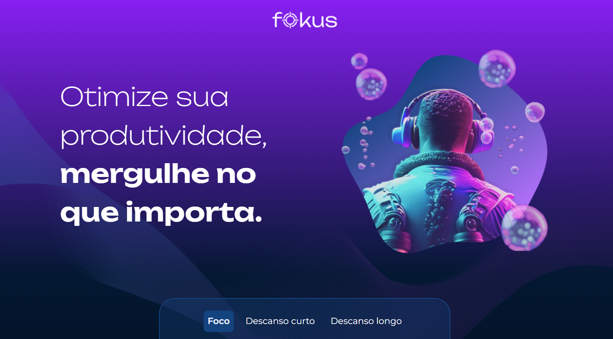

# Fokus

Uma landing page responsiva, com a ideia de sessões de relaxamento com tempo e música interativa.

## 🔨 Funcionalidades do projeto

Esse projeto foi baseado em uma aula da Alura. Focado especificamente em javascript. O projeto está dispónivel no [Figma](https://www.figma.com/files/recents-and-sharing/recently-viewed?fuid=1308970617800034366) para versões mobile, tablet e desktop.

## ✔️ Técnicas e tecnologias utilizadas

-`HTML`
-`CSS`
-`Javascript`
-`Acessibilidade Web`
-`Figma`

## 🛠️ Abrir e rodar o projeto

Para abrir e rodar o projeto, utilize um editor de código de sua escolha.
Depois, abra o projeto no seu navegador.

## VERCEL 
https://relax-delta.vercel.app/
